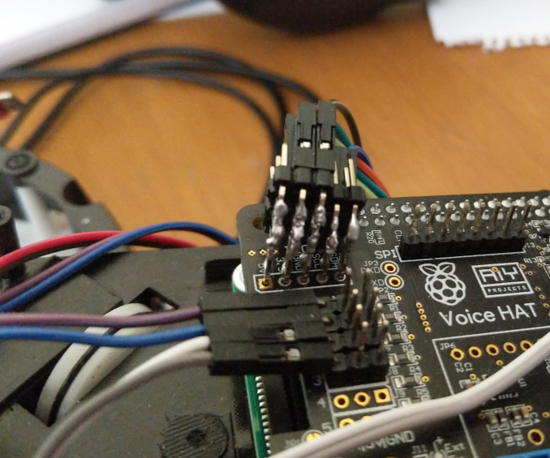
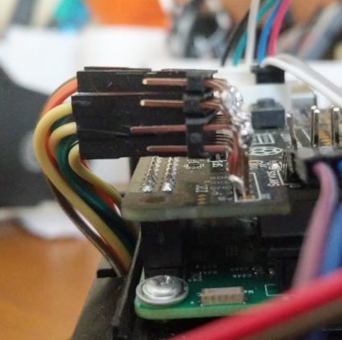

# The first IoT robot
I read in a blog years ago about a guy who used a Rabbit toy to get alerts when a Jenkins job finished, using the original SW of the robot to achieve it, of course the original purpose of the toy was not that... I really liked the idea of having an IoT hacked robot to make your own alerts. Then some months ago I tried to find that blog and it was imposible, but at least I was able to find the toy!  
Its name is [**Nabaztag**](https://en.wikipedia.org/wiki/Nabaztag) (second version called Karotz) and was made by a company called Violet, you can read about it in [Wikipedia](https://en.wikipedia.org/wiki/Nabaztag). 

The main purpose of this IoT toy was to be able to read mails, play some music, alarm clock and others, connected to your wifi network (WEP). The toy had also some RGB leds and it could wiggle its ears.
The original servers that provided the robot services were discontinued in late July 2011. There are some open source developments and alternative servers to revive the robot with the original hardware, but the connection to old WEP networks and the few things that you can make with the API makes me discard this option.

# Install a Raspberry inside the robot
Then when I was about to forget the rabbit I found an incredible article in Hackster that explains how to [install a Raspberry inside a Nabaztag](https://www.hackster.io/bastiaan-slee/nabaztag-gets-a-new-life-with-google-aiy-e9f2c8) and what is more important, how to keep working the ears and the volume wheel through the Raspberry interfaces, what really opens a world of interesting things to do, we can: 
- Connect the rabbit to a modern wifi network
- Install Google assistant or any other voice recognition software
- Code our own commands
- Give the Rabbit ears movements and voice.

I've never made anything so complex with electronics and soldering but I already had the [Google AIY Voice HAT](https://aiyprojects.withgoogle.com/voice-v1/), so this could be a funny way to start learning some basics.

I found a second hand Nabaztag and I bought all the required components and started to solder and follow the steps in the article. I found everything nice explained except for the split of the **I2C interface** 

Trought this interface you have to connect 2 ear encoders (with two wires each: 3.3v and ground), the volume control wheel (two wires: 3.3v and ground) and the ADS1115 (3.3v, ground, SCL and SDA) but the Raspberry/Google Hat original interface only gives you 1 pin for each (one 3.3v, one ground, one SCL and one SDA).
To achieve this I soldered 4 rows of pins together (three rows with five pins and the other one with three pins) with an Elbow 40 Pin Header strip:

###### You can cut some five-pins pieces, put together the shortest sides of the elbows and solder them

And once I had this piece I soldered it to the interface to have enought connections for all the required pins:
 

Its really fun to build your own something like this and start to see it working! I only have words of thanks to [Bastiaan](https://www.hackster.io/bastiaan-slee)

In the next post we will see how to start with the software and do some scripts in Python.
